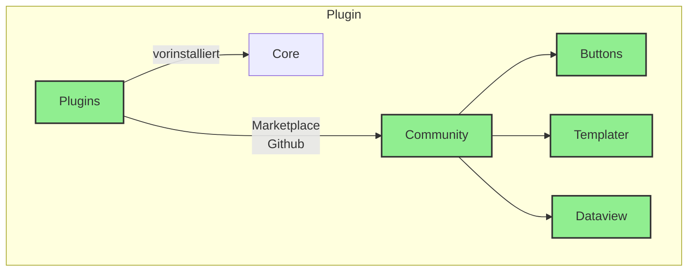
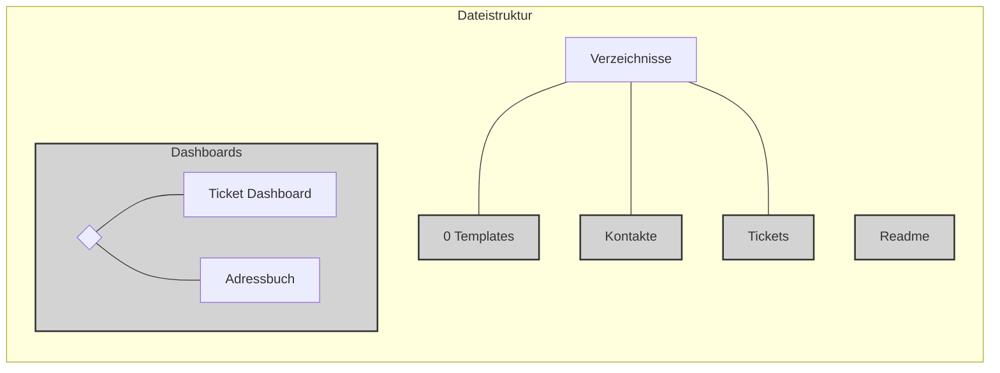

### Workflows in Obsidian 
#### am Beispiel
#### Ticketsystem und Adressbuch

---

```mermaid

flowchart TD

subgraph Plugin
Plugins -->|vorinstalliert| Core
Plugins ---> |Marketplace\nGithub| Community 
Community --> Buttons
Community --> Templater
Community --> Dataview
end

classDef green fill:lightgreen,stroke:#333,stroke-width:2px;
class Plugins,Community,Buttons,Templater,Dataview green;
```

---

```mermaid

flowchart BT

subgraph Dateistruktur 

V[Verzeichnisse] --- T[0 Templates]
V---Kontakte
V---Tickets

subgraph Dashboards
A{ }---TI[Ticket Dashboard]
A---Adressbuch
end
Readme
end

classDef grey fill:lightgrey,stroke:#333,stroke-width:2px;
class T,Kontakte,Tickets,Dashboards,Readme grey;
class Readme internal-link;
```

---

### Workflow ->