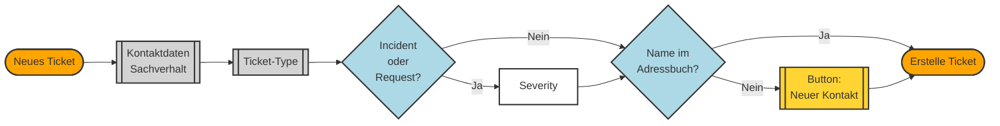

```mermaid

graph LR

N([Neues Ticket])
C[[Kontaktdaten<br>Sachverhalt]]
T[[Ticket-Type]]
%%S[[Sachverhalt]]
I{Incident<br>oder<br>Request?}
F{Name im<br>Adressbuch?}
E([Erstelle Ticket])
B[[Button:<br>Neuer Kontakt]]
G[Severity]

N-->C-->T-->I
I -->|Ja| G
I -->|Nein| F
G --> F
F --> |Ja|E
F-->|Nein| B
B-->E

classDef orange fill:orange,stroke:#333,stroke-width:2px;
classDef lightorange fill:#ffd433,stroke:#333,stroke-width:2px;
classDef grey fill:lightgrey,stroke:#333,stroke-width:2px;
classDef blue fill:lightblue,stroke:#333,stroke-width:2px;
classDef white fill:white,stroke:#333,stroke-width:2px;

class N,E orange
class B lightorange
class I,F blue
class C,S,T grey
class G white

```
